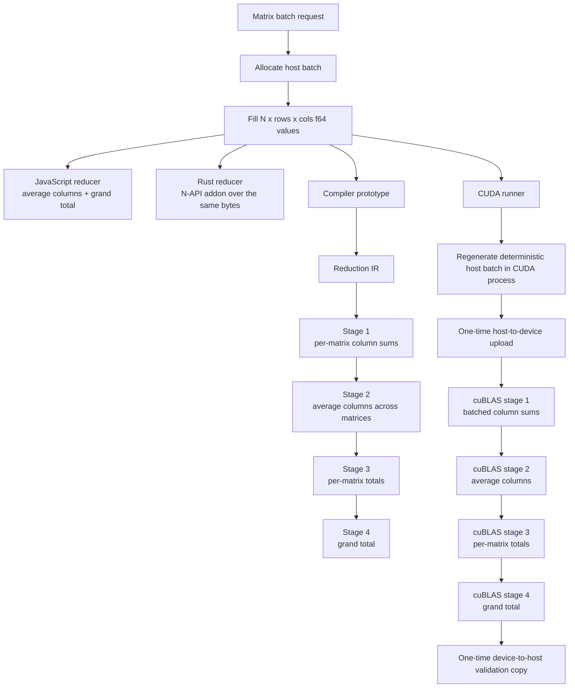
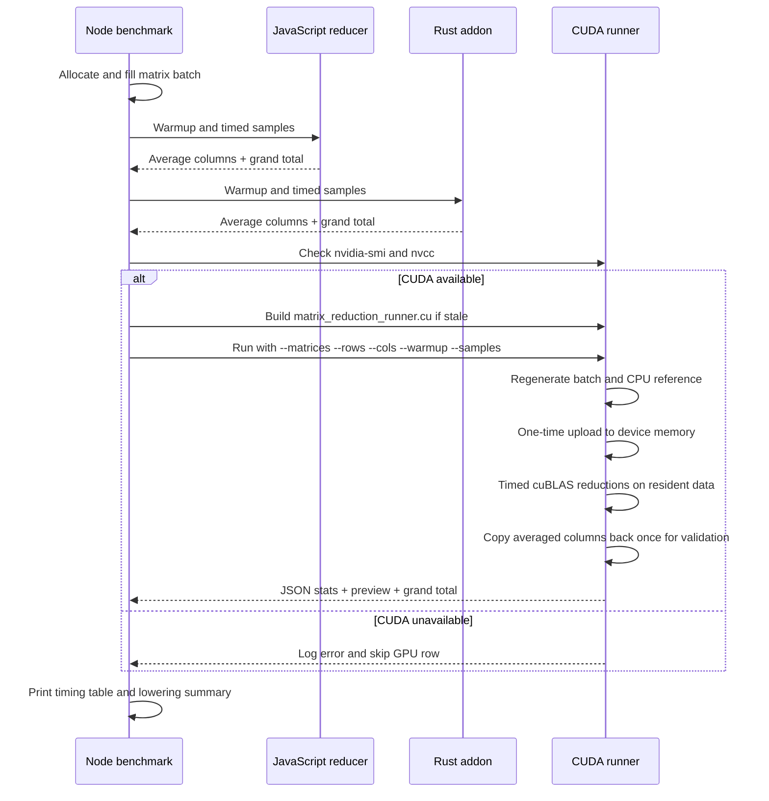

# sharing-memory

This repository now contains two distinct experiments:

1. The original shared-memory mutation benchmark over a `6 x 6` demo matrix and larger `u32` buffers.
2. A batched `float64` matrix aggregation experiment that compares JavaScript, a Rust N-API addon, a GPU-lowering artifact, and an executable CUDA runner.

The batched `float64` aggregation path is the main focus of the current codebase.

## Quick Start

```bash
npm install
npm run build
```

Run the original shared-memory demo:

```bash
npm run demo
```

Run the batched matrix aggregation demo:

```bash
npm run demo:matrix
```

Run the original mutation benchmark:

```bash
npm run bench:quick
```

Run the batched matrix aggregation benchmark:

```bash
npm run bench:matrix
```

On a machine with an NVIDIA GPU and the CUDA toolkit installed, `bench:matrix` also attempts the CUDA path. If `nvidia-smi` or `nvcc` is unavailable, the benchmark logs an error and continues with the CPU rows.

## Experiments

| Experiment | Entry point | What it measures |
| --- | --- | --- |
| Shared-memory mutation benchmark | `src/benchmark.ts` | In-place `u32` mutation across JS, Rust native, wasm, and IPC workers |
| Matrix aggregation demo | `src/matrix-aggregation-demo.ts` | Deterministic `f64` matrix-batch generation plus JS, Rust, GPU-lowering, and optional CUDA inspection |
| Matrix aggregation benchmark | `src/matrix-aggregation-benchmark.ts` | Timed batched aggregation in JS, Rust, and optionally CUDA |

## Batched Matrix Aggregation Experiment

The new experiment operates on `N` matrices of shape `rows x cols`, all stored contiguously in one flat `Float64Array` or Node `Buffer`.

### Workload Definition

Each matrix cell is deterministic and depends on the matrix index as well as the row and column:

```text
value(matrix, row, col) =
  (matrix * 0.75) +
  (row * 0.5) +
  (col * 0.25) +
  (((matrix ^ row ^ col) & 7) * 0.125)
```

For each run, the aggregation is:

```text
perMatrixColumnSums[matrix, col] =
  sum(value(matrix, row, col) for row in 0..rows-1)

averageColumnSums[col] =
  sum(perMatrixColumnSums[matrix, col] for matrix in 0..matrices-1) / matrices

matrixTotals[matrix] =
  sum(perMatrixColumnSums[matrix, col] for col in 0..cols-1)

grandTotal =
  sum(matrixTotals[matrix] for matrix in 0..matrices-1)
```

The default benchmark shape is:

- `matrices = 4`
- `rows = 1000`
- `cols = 1000`
- `total cells = 4,000,000`
- `host batch size = 32,000,000 bytes` or about `30.52 MiB`

Because the JavaScript and Rust paths use the same deterministic formula and the same accumulation order, the benchmark compares them by exact equality instead of an epsilon.

### What Is Implemented

- A JavaScript batch generator and reducer over `Float64Array`
- A Rust native addon that fills and aggregates the same underlying Node `Buffer`
- A compile-only GPU-lowering artifact that emits a four-stage block-parallel reduction pipeline
- A CUDA runtime benchmark that executes the same batched aggregation on NVIDIA hardware with a device-resident cuBLAS-backed path

### End-to-End Flow



### Benchmark Orchestration



## CPU Implementations

### JavaScript Path

The TypeScript implementation lives in `src/f64-matrix.ts`. It:

- validates `matrices`, `rows`, and `cols`
- fills one flat `Float64Array` with deterministic values
- computes one column-sum vector per matrix
- averages those column sums across matrices
- computes a grand total by summing each matrix total

### Rust Path

The Rust implementation lives in `native/src/f64_matrix.rs` and is exposed through `native/src/lib.rs`. It:

- fills an existing Node `Buffer` as `f64`
- aggregates into an output buffer of averaged column sums
- returns the `grandTotal` as `f64`
- matches the JavaScript path’s value formula and accumulation order

## GPU Lowering And CUDA Runtime

There are two GPU-related pieces in this repository.

### 1. Compiler Lowering Artifact

The compiler prototype lives in `native/src/gpu_pipeline.rs`. For the batch aggregation experiment it emits:

- a high-level reduction pipeline description
- `stage1KernelIr` for `matrix_column_sum_f64`
- `stage2KernelIr` for `average_columns_f64`
- `stage3KernelIr` for `matrix_totals_f64`
- `stage4KernelIr` for `grand_total_f64`
- PTX-like text for the four stages
- a host-side launch sketch

This artifact is inspection-only in the local workspace. It exists to show where a real compiler would branch away from Cranelift and into a GPU-specific lowering path.

### 2. Executable CUDA Benchmark Path

The executable CUDA path lives in `cuda/matrix_reduction_runner.cu` and is launched by `src/cuda-matrix-runner.ts`.

The execution flow is:

1. Node checks `nvidia-smi` and `nvcc`.
2. If needed, Node compiles `cuda/matrix_reduction_runner.cu` with `nvcc -lcublas`.
3. Node launches the CUDA runner with `--matrices`, `--rows`, `--cols`, `--warmup`, and `--samples`.
4. The CUDA process regenerates the same deterministic matrix batch in its own host memory.
5. The CUDA process uploads the matrices and `1.0` reduction vectors to device memory once before warmup.
6. Each timed sample runs a cuBLAS-backed reduction pipeline over device-resident data.
7. After the timed samples, the CUDA process copies back the averaged columns, validates them against its CPU reference, and returns JSON timing data to Node.

The runtime path is cuBLAS-backed:

- stage 1: `cublasDgemmStridedBatched` computes one column-sum vector per matrix from the row-major batch
- stage 2: `cublasDgemv` averages those column sums across matrices
- stage 3: `cublasDgemv` with transpose computes one total per matrix
- stage 4: `cublasDdot` sums the per-matrix totals into `grandTotal`

Important detail: the CUDA runner still does not consume the exact Node `Buffer`. It regenerates the same deterministic batch inside the CUDA process. Also, the timed GPU row is now intentionally device-resident: the one-time host-to-device upload and the final device-to-host copy are outside the timed sample window so the benchmark reflects the GPU compute path rather than PCIe overhead.

### What The CUDA Timing Includes

The GPU row now measures device-resident compute for each sample:

- batched matrix-to-column reduction with cuBLAS
- averaged-column reduction across matrices
- per-matrix total reduction
- final total reduction
- device synchronization

It does not include:

- the one-time host-to-device upload of the matrix batch
- the one-time upload of the reduction vectors
- the final device-to-host copy of `averageColumnSums`
- the final device-to-host copy of `grandTotal`
- `nvcc` compilation time
- Node build time
- native addon build time

If you want an end-to-end PCIe-included GPU row as well, that is a separate benchmark mode to add. The current CUDA row is intentionally the “push the GPU” path.

## Running The Matrix Experiment

### Demo

```bash
npm run demo:matrix
```

The demo prints:

- sample deterministic matrix values
- the JavaScript `grandTotal`
- a preview of the first averaged columns
- the Rust `grandTotal`
- the GPU lowering source, reduction IR, four stage kernels, and host launch sketch
- the CUDA runtime result if an NVIDIA GPU and CUDA toolkit are available

On a non-CUDA machine, the demo logs an error like this and continues:

```text
GPU benchmark unavailable: `nvidia-smi` is not available or no NVIDIA GPU is visible.
```

### Benchmark

```bash
npm run bench:matrix
```

The default benchmark uses:

- `matrices = 4`
- `rows = 1000`
- `cols = 1000`
- `warmup = 3`
- `samples = 10`

You can also run the emitted script directly:

```bash
node dist/matrix-aggregation-benchmark.js --matrices 4 --rows 1000 --cols 1000 --warmup 3 --samples 10
```

Available flags:

- `--matrices`: positive integer number of matrices
- `--rows`: positive integer row count per matrix
- `--cols`: positive integer column count per matrix
- `--warmup`: non-negative warmup count
- `--samples`: positive number of timed samples

### Benchmark Output

The benchmark prints one row per successful implementation:

- `js / f64 batch aggregation`
- `rust / napi batch aggregation`
- `gpu / cuda resident batch aggregation (cuBLAS)` when CUDA is available

Each row reports:

- `avg`: arithmetic mean across timed samples
- `med`: median sample
- `min` / `max`: best and worst sample
- `GiB/s`: rough effective throughput based on the logical device-side reduction traffic
- relative slowdown compared with the fastest row in that run

After the timing table, the benchmark also prints:

- the GPU device name, if a GPU row ran
- the names of the four lowered GPU kernels
- the PTX artifact size
- the reference `grandTotal`
- the first few averaged columns

### Current Local CPU Result

The most recent local run in this workspace, using the default `4 x 1000 x 1000` shape on a machine without an NVIDIA GPU, produced:

| Scenario | avg ms | median | min | max | GiB/s | relative |
| --- | ---: | ---: | ---: | ---: | ---: | ---: |
| `js / f64 batch aggregation` | 4.012 | 4.024 | 3.914 | 4.152 | 7.43 | 1.84x |
| `rust / napi batch aggregation` | 2.178 | 2.185 | 2.098 | 2.316 | 13.69 | 1.00x |

That run skipped the CUDA row because the local machine had no visible NVIDIA runtime.

## NVIDIA Requirements

To run the CUDA path on another machine, the benchmark currently expects:

- an NVIDIA GPU visible to `nvidia-smi`
- the CUDA toolkit installed with `nvcc` on `PATH`

If either check fails:

- the benchmark logs an error
- the CPU rows still run
- the process still exits successfully unless a CPU implementation fails

That fallback is intentional so the repository remains runnable on machines without CUDA.

## Source Map

Batch aggregation files:

- `src/f64-matrix.ts`: JavaScript batch generation and aggregation
- `src/f64-view.ts`: `Float64Array` view helper over Node buffers
- `src/matrix-aggregation-demo.ts`: human-readable batch demo
- `src/matrix-aggregation-benchmark.ts`: batch benchmark harness
- `src/cuda-matrix-runner.ts`: Node wrapper that compiles and runs the CUDA benchmark
- `native/src/f64_matrix.rs`: Rust batch generation and aggregation
- `native/src/lib.rs`: N-API bindings
- `native/src/gpu_pipeline.rs`: compile-only GPU lowering artifact
- `cuda/matrix_reduction_runner.cu`: executable CUDA benchmark implementation

Original mutation benchmark files:

- `src/benchmark.ts`
- `src/mutation.ts`
- `native/src/matrix.rs`
