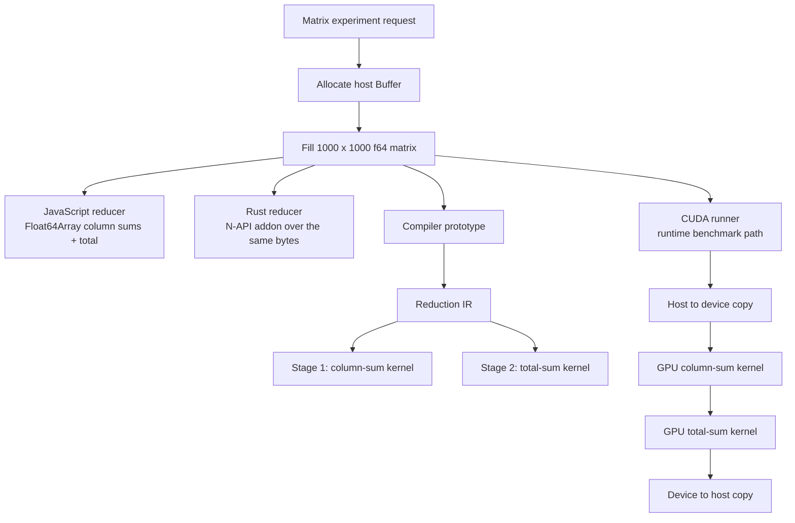
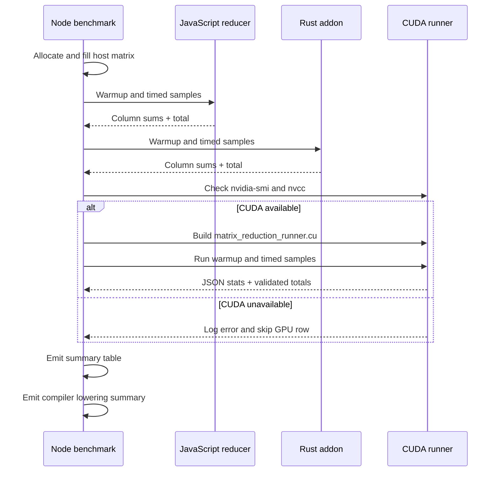

# sharing-memory

This repository contains two related experiments:

1. The original shared-memory mutation benchmark that compares TypeScript, a Rust native addon, WebAssembly, and IPC workers over a large `u32` matrix.
2. A newer `float64` matrix aggregation experiment that generates a deterministic `1000 x 1000` matrix, computes per-column sums plus a final total in JavaScript and Rust, emits a matching GPU lowering artifact, and can run the same reduction on an NVIDIA GPU through a CUDA runner.

The matrix aggregation experiment is the primary focus of the current codebase update.

## Quick Start

```bash
npm install
npm run build
```

Run the original small shared-memory demo:

```bash
npm run demo
```

Run the matrix aggregation demo:

```bash
npm run demo:matrix
```

Run the original mutation benchmark:

```bash
npm run bench:quick
```

Run the matrix aggregation benchmark:

```bash
npm run bench:matrix
```

On a machine with an NVIDIA GPU and the CUDA toolkit installed, `bench:matrix` will also try to run the CUDA implementation. If `nvidia-smi` or `nvcc` is unavailable, the benchmark logs an error and continues with the CPU rows.

## Experiments

| Experiment | Entry point | What it measures |
| --- | --- | --- |
| Shared-memory mutation benchmark | `src/benchmark.ts` | In-place `u32` mutation across JS, Rust native, wasm, and IPC |
| Matrix aggregation demo | `src/matrix-aggregation-demo.ts` | Deterministic `f64` matrix generation plus JS, Rust, and GPU-lowering inspection |
| Matrix aggregation benchmark | `src/matrix-aggregation-benchmark.ts` | Timed column aggregation in JS, Rust, and optionally CUDA |

## Matrix Aggregation Experiment

The new experiment builds a `1000 x 1000` matrix of `float64` values, computes one sum per column, then computes a final total by summing those column sums.

### Workload Definition

The matrix values are deterministic and generated from the same formula in both TypeScript and Rust:

```text
matrix[row, col] = (row * 0.5) + (col * 0.25) + (((row ^ col) & 7) * 0.125)
```

For each run:

```text
columnSums[col] = sum(matrix[row, col] for row in 0..rows-1)
total = sum(columnSums[col] for col in 0..cols-1)
```

The default benchmark shape is:

- `rows = 1000`
- `cols = 1000`
- `cells = 1,000,000`
- `matrix size = 8,000,000 bytes` or about `7.63 MiB`

### What Is Implemented

- A JavaScript generator and reducer over `Float64Array`
- A Rust native addon that fills and aggregates the same `Buffer` as `f64`
- A GPU lowering artifact that emits a two-stage reduction pipeline and PTX-like text
- A practical CUDA runtime benchmark runner that executes the same reduction on NVIDIA hardware when available

### End-to-End Flow



### Benchmark Orchestration



## CPU Implementations

### JavaScript Path

The TypeScript implementation lives in `src/f64-matrix.ts`. It:

- validates matrix dimensions
- fills the matrix into a `Float64Array`
- zeroes a `Float64Array` for column sums
- accumulates columns row by row
- computes a final total by summing the column sums

The benchmark uses this path as the host-side reference.

### Rust Path

The Rust implementation lives in `native/src/f64_matrix.rs` and is exposed through `native/src/lib.rs`. It:

- fills an existing Node `Buffer` as `f64`
- aggregates column sums into another `Buffer`
- returns the final total as `f64`
- shares the same deterministic formula and accumulation order as the JavaScript implementation

Because both CPU paths sum values in the same order, they compare by exact equality rather than epsilon tolerance.

## GPU Lowering And CUDA Runtime

There are two GPU-related pieces in this repository.

### 1. Compiler Lowering Artifact

The prototype lowering lives in `native/src/gpu_pipeline.rs`. For the matrix reduction experiment it emits:

- a reduction pipeline description
- a stage-1 kernel IR for column sums
- a stage-2 kernel IR for the final total
- PTX-like output for both kernels
- a host-side launch sketch

The demo prints this artifact so you can inspect the compiler shape even on machines without CUDA.

### 2. Executable CUDA Benchmark Path

The actual GPU benchmark path lives in `cuda/matrix_reduction_runner.cu` and is invoked by `src/cuda-matrix-runner.ts`.

This runner:

- allocates the same deterministic host matrix
- computes a CPU reference result inside the CUDA process
- allocates device buffers
- copies the matrix to the GPU for each sample
- launches one kernel that computes one `f64` column sum per thread
- launches a second kernel that reduces the column sums into a single total
- copies the column sums and total back to host memory
- validates the GPU result against the CPU reference
- prints JSON timing data back to the Node benchmark

The benchmark currently treats the GPU row as an end-to-end host-visible operation, which means the timed window includes:

- host-to-device copy
- both kernel launches
- device synchronization
- device-to-host copy

It does not include:

- `nvcc` compilation of the CUDA runner
- Node build time
- native addon build time

That compile step happens before the timed samples begin.

## Running The Matrix Experiment

### Demo

```bash
npm run demo:matrix
```

The demo prints:

- sample matrix values
- the JavaScript total
- a preview of the first few column sums
- the Rust total
- the GPU lowering source, reduction IR, stage kernels, and host launch sketch
- the CUDA runtime result if an NVIDIA GPU and CUDA toolkit are available

On a non-CUDA machine, the demo logs an error like this and continues:

```text
GPU benchmark unavailable: `nvidia-smi` is not available or no NVIDIA GPU is visible.
```

### Benchmark

```bash
npm run bench:matrix
```

The default benchmark uses:

- `rows = 1000`
- `cols = 1000`
- `warmup = 3`
- `samples = 10`

You can also run the emitted script directly:

```bash
node dist/matrix-aggregation-benchmark.js --rows 1000 --cols 1000 --warmup 3 --samples 10
```

Available flags:

- `--rows`: positive integer row count
- `--cols`: positive integer column count
- `--warmup`: non-negative warmup count
- `--samples`: positive number of timed samples

### Benchmark Output

The benchmark prints one row per successful implementation:

- `js / float64 column aggregation`
- `rust / napi column aggregation`
- `gpu / cuda runtime (h2d + d2h)` when CUDA is available

Each row reports:

- `avg`: arithmetic mean across timed samples
- `med`: median sample
- `min` / `max`: best and worst sample
- `GiB/s`: rough effective throughput based on the matrix plus output traffic
- relative slowdown compared with the fastest row in that run

After the timing table, the benchmark also prints:

- the GPU device name, if a GPU row ran
- the names of the two lowered GPU kernels
- the PTX artifact size
- the reference total
- the first few reference column sums

### Current Local CPU Result

The most recent local run in this workspace, on a machine without an NVIDIA GPU, produced:

| Scenario | avg ms | median | min | max | GiB/s | relative |
| --- | ---: | ---: | ---: | ---: | ---: | ---: |
| `js / float64 column aggregation` | 1.041 | 1.015 | 0.987 | 1.265 | 7.17 | 6.42x |
| `rust / napi column aggregation` | 0.162 | 0.162 | 0.158 | 0.171 | 46.04 | 1.00x |

That run skipped the CUDA row because no NVIDIA runtime was available locally.

## NVIDIA Requirements

To run the CUDA path on another machine, the benchmark currently expects:

- an NVIDIA GPU visible to `nvidia-smi`
- the CUDA toolkit installed with `nvcc` on `PATH`

If either of those checks fails:

- the benchmark logs an error
- the CPU rows still run
- the process still exits successfully unless a CPU implementation fails

That behavior is intentional so the repo remains runnable on non-GPU machines.

## Source Map

Matrix aggregation files:

- `src/f64-matrix.ts`: JavaScript matrix generation and aggregation
- `src/f64-view.ts`: `Float64Array` view helper over Node buffers
- `src/matrix-aggregation-demo.ts`: human-readable demo
- `src/matrix-aggregation-benchmark.ts`: benchmark harness
- `src/cuda-matrix-runner.ts`: Node wrapper that compiles and runs the CUDA benchmark
- `native/src/f64_matrix.rs`: Rust matrix generation and aggregation
- `native/src/lib.rs`: N-API bindings
- `native/src/gpu_pipeline.rs`: compiler lowering artifact for GPU kernels
- `cuda/matrix_reduction_runner.cu`: executable CUDA benchmark implementation

Original mutation benchmark files:

- `src/benchmark.ts`
- `src/mutation.ts`
- `native/src/matrix.rs`
- `src/ipc-protocol.ts`
- `src/ipc-node-worker.ts`
- `native/src/bin/ipc_rust_worker.rs`

## Original Shared-Memory Mutation Benchmark

The original benchmark is still intact and still measures these scenarios over a large flat `u32` matrix:

- native shared buffer mutated in TypeScript
- native shared buffer mutated in Rust
- wasm linear memory mutated in TypeScript
- wasm linear memory mutated in Rust
- IPC roundtrip through a Node child
- IPC roundtrip through a Rust child

Run it with:

```bash
npm run bench
```

Or a quicker version:

```bash
npm run bench:quick
```

That experiment remains useful for comparing memory boundaries. The new matrix aggregation experiment is the better fit when you want a concrete reduction workload with a CPU path, a Rust native path, and an optional NVIDIA GPU execution path.
